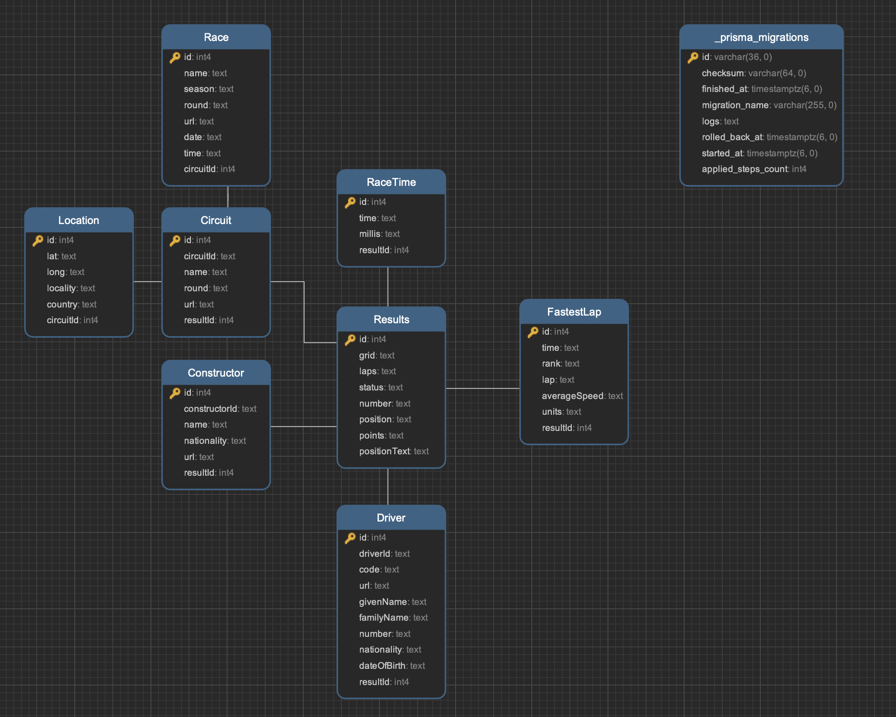

# Racing_F1_results
------------------------------------------------------------------------
## Chuẩn bị dữ liệu

Sau khi research và so sánh dữ liệu với trang web [formula1.com](https://www.formula1.com/), nhận thấy dữ liệu cùng 1 nguồn nên mình sử dụng bộ API này để seed data.

[Formula One API](https://www.postman.com/maintenance-astronomer-29796265/workspace/f1-api/collection/19328871-63c4a82c-ae84-4a24-a58b-bd8a408b1c4e)

Từ các dữ liệu, mình dựng một cơ sở dữ liệu quan hệ để lưu trữ thông tin kết quả các cuộc đua, thông tin vận động viên và câu lạc bộ của họ.



Dữ liệu seed nằm trong file prisma/seed.ts
------------------------------------------------------------------------

## Setup môi trường
Cài đặt docker, docker compose trên máy để tiện việc dựng 1 container postgres
Tạo file .env và copy file .dev.env sang file .env
```
docker compose up -d
```

Sau đó chạy câu lệnh để install package, migrate và start server

```
npm i npx && 
npm install &&
npx prisma migrate dev && 
npm run dev
```

Server chạy port 300
------------------------------------------------------------------------
## API
API lấy danh sách kết quả các cuộc đua
API có cung cấp các query params có thể truyền vào để thực hiện phân trang và tìm kiếm theo tên vận động viên hoặc tên câu lạc bộ
- limit
- page
- driver
- constructor
```
curl --location 'http://localhost:3000/races?limit=3&page=1&driver=Max&constructor=Bull' \
--data ''
```